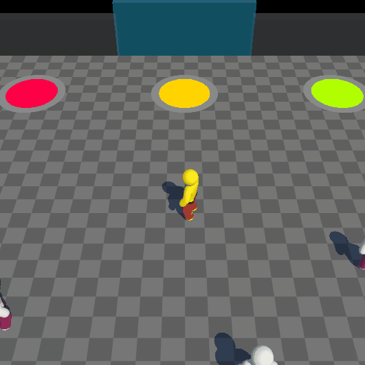
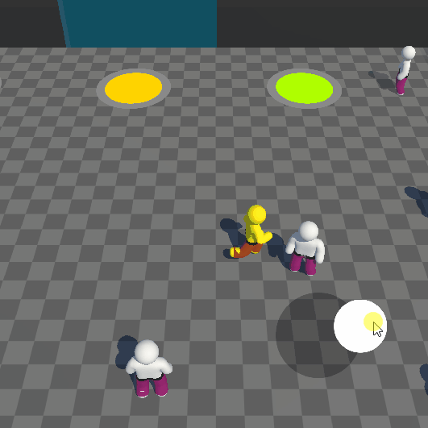
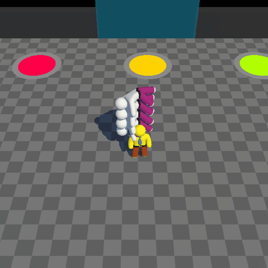
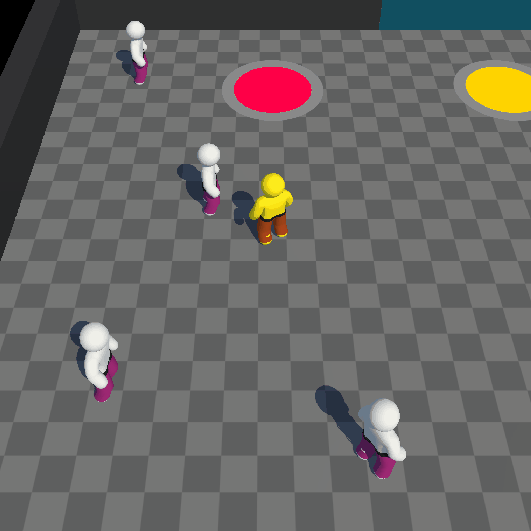

# 3D Ragdoll Implementation

# Overview
This Unity 3D project showcases a dynamic ragdoll system, allowing players to control a character using a joystick, execute punches, stack defeated enemies on their back to generate money, and purchase upgrades to enhance the gameplay counting stacked enemies.

## APK for test
[Download APK](https://github.com/muriloglasser/3D-ragdoll-implementation/blob/Readme-update/Punch%20Game.apk)

# How to Run the Project
Download Unity 2023.1.15f1.

Download the OpenJDK module and Android SDK & NDK tools for Android builds.

Download the iOS Build Support module for iOS builds.

Clone the repository to your local machine.

Open the project in Unity.

Change the build platform to Android or iOS.

Run the project with the Unity simulator window to test it locally.

# Features
### Player Controls
Control your character with a joystick.

### Punching Enemies
Approach enemies to unleash powerful punches.

### Money Generation
Stack defeated characters vertically on your character's back and deposit the stacked characters in a designated area to accumulate wealth.

### Level Up
Visit the in-game store to spend your hard-earned money on leveling up. Each level achieved increases your stacking capacity.

### Color Shop
Stack characters, earn money, and explore the color shop to purchase new and exciting skin colors for your character.

### Inertia Mechanics
Experience inertia as characters are stacked on your back while walking. The movement is calculated via code, avoiding the use of joints or animations.

